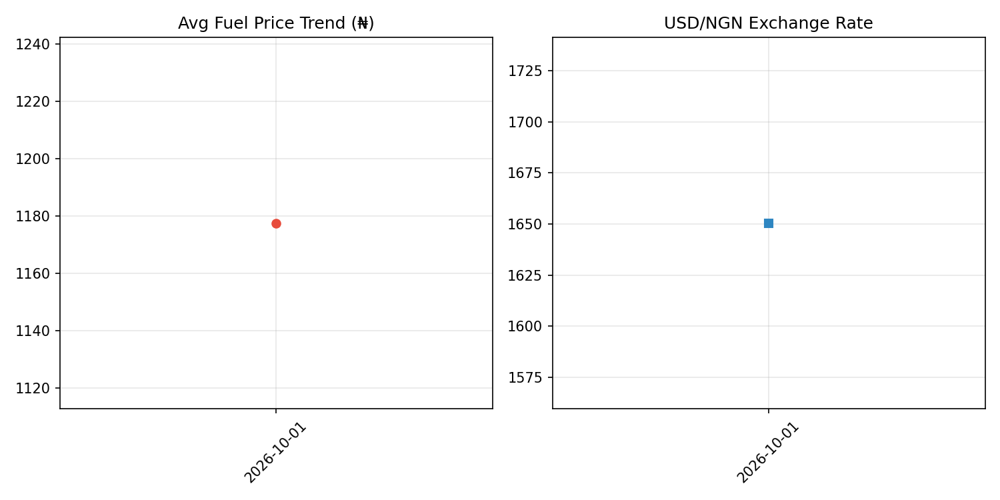

# Nigeria Fuel Price Intelligence System

Correlates PMS fuel prices across Abuja stations with USD/NGN exchange rate to predict impact on building materials and transport costs.

## Problem
Fuel price in Nigeria varies by ₦300+ between NNPC and black market, and directly drives cement, blocks, and transport costs. No open dataset tracks this correlation.

## Architecture
- **Extract:** Multi-source ingestion — NNPC official, independent marketers (Total, AP), black market + FX rate from CBN API
- **Transform:** Cleaning, USD conversion (fuel_price_usd = fuel_ngn / fx_rate), source classification
- **Load:** Time-series warehouse `nigeria_fuel_fx.csv` with deduplication
- **Analytics:** Dual-trend visualization and impact prediction model

## Key Insight
> When fuel rises 10%, building materials typically rise 6-8% within 72 hours. This system gives 3-day early warning.

## Results
- Tracks price spread: NNPC ₦1,030 vs Black Market ₦1,350 (31% arbitrage)
- FX-adjusted fuel price analysis
- Automated BUY recommendation before market-wide price hike

## Tech Stack
Python, Pandas, BeautifulSoup (Web Scraping), Requests (API), Matplotlib, Correlation Analysis

## How to Run
pip install -r requirements.txt
python main.py

## Future Roadmap
- [ ] Real-time scraper for mytotal.com.ng
- [ ] Integrate with `abuja-price-intelligence` repo to auto-predict cement price
- [ ] Telegram alert bot